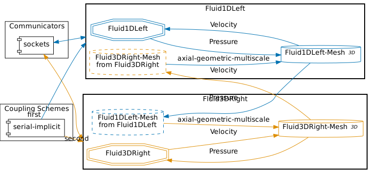
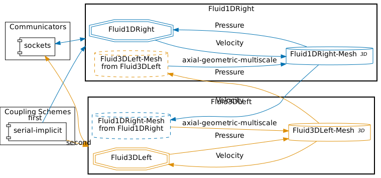
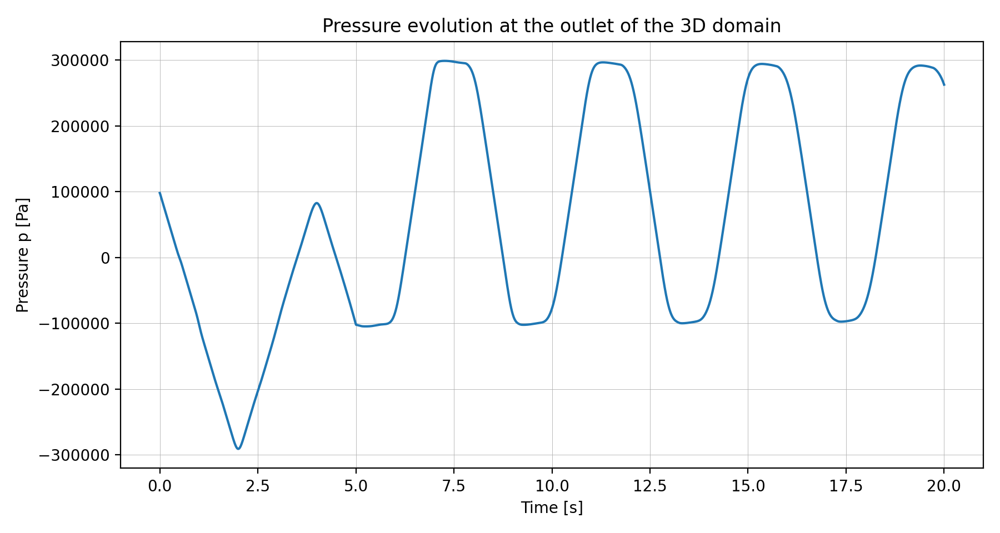


Get the [case files of this tutorial](https://github.com/precice/tutorials/tree/develop/water-hammer), as continuously rendered here, or see the [latest released version](https://github.com/precice/tutorials/tree/master/water-hammer) (if there is already one). Read how in the [tutorials introduction](https://precice.org/tutorials.html).


## Setup

We solve a **partitioned water hammer problem** using a 1D–3D coupling approach.  
In this tutorial, the computational domain is split into two coupled regions: a 1D pipe section and a 3D pipe section.  
The coupling is performed using **preCICE**.

In addition to the 1D–3D setup, this tutorial also includes configurations for **1D–1D** and **3D–3D** coupling.  
These variants can be beneficial for validation studies, solver comparisons, or for investigating the influence of model dimensionality on transient wave propagation.

The case setup is inspired by [1].  
This tutorial extends the study conducted in [2], which implemented the water hammer benchmark using a 1D–3D coupling with preCICE.  
In that study, the cross-section of the pipe was square. In this tutorial, this has been changed to a circular cross-section.  
In the following, $\mathrm{1D}$ denotes the reduced-order domain (e.g., a Nutils solver) and $\mathrm{3D}$ denotes the full 3D CFD domain (e.g., OpenFOAM).

The problem consists of a straight pipe of length  $L = 1000 \mathrm{m}$ and diameter $D = 2 \mathrm{m}$. We partition the domain at $y_c = 500 \mathrm{m}$, where the coupling interface is located.  
The **1D domain** solves the unsteady compressible flow equations using Nutils, while the **3D domain** is solved using OpenFOAM.  
Both solvers are coupled via preCICE by exchanging the **pressure** and **axial velocity** at the interface.

Two coupling directions are possible:

- **1D → 3D**: The 1D solver provides the interface pressure to the 3D solver, which responds with velocity.  
- **3D → 1D**: The 3D solver provides the pressure, and the 1D solver returns the velocity.

The initial inlet pressure is set to $p_{\mathrm{in}} = 98100 \mathrm{Pa}$.
The opening valve at the outlet is modeled through a prescribed outlet velocity, which increases linearly from $0 \mathrm{m/s}$ to $1 \mathrm{m/s}$ over the first $t = 5 \mathrm{s}$, and remains constant afterwards.  
This sudden valve opening generates pressure disturbances that propagate through the pipe, resulting in the characteristic **pressure wave oscillations** known as the *water hammer* phenomenon.

---

## Configuration

preCICE configuration for the 1D–3D simulation (image generated using the [precice-config-visualizer](https://precice.org/tooling-config-visualization.html)):



preCICE configuration for the 3D–1D simulation:



---

## Available solvers

- OpenFOAM (sonicLiquidFoam). A compressible OpenFOAM solver. For more information, have a look at the [OpenFOAM adapter documentation](https://precice.org/adapter-openfoam-overview.html).  
- Nutils. A Python-based finite element framework. For more information, see the [Nutils adapter documentation](https://precice.org/adapter-nutils.html).

---

## Running the Simulation

First, select which coupling you want to run. This sets the correct `precice-config.xml` symlink (by default, set to `1d3d`).

```bash
# Choose one configuration
./setcase.sh 1d3d
# or
./setcase.sh 3d1d
# or
./setcase.sh 1d1d
# or
./setcase.sh 3d3d
```

The additional 1D–1D and 3D–3D configurations are particularly useful for validation purposes and for comparing reduced-order and full-order modeling approaches.

Open **two terminals** and start the corresponding participants for your chosen setup.

### Example A — 1D → 3D coupling

Terminal 1:

```bash
cd fluid1d-left-nutils
./run.sh
```

Terminal 2:

```bash
cd fluid3d-right-openfoam
./run.sh
```

### Example B — 3D → 1D coupling

Run `./setcase.sh 3d1d` and then navigate to the respective directories.

Terminal 1:

```bash
cd fluid3d-left-openfoam
./run.sh
```

Terminal 2:

```bash
cd fluid1d-right-nutils
./run.sh
```

---

## Visualization

The output of the coupled simulation is written into the folders `fluid1d-left-nutils`, `fluid1d-right-nutils`, `fluid3d-left-openfoam`, and `fluid3d-right-openfoam`, depending on which coupling direction (`1d3d` or `3d1d`) you selected.

### 3D domain (OpenFOAM)

For the 3D participant, all simulation results are stored in the time directories inside the respective case folder (e.g., `fluid3d-right-openfoam/`).  
You can visualize the flow field and pressure distribution using **ParaView** by opening the case file:

```bash
paraview fluid3d-right-openfoam/fluid3d-right-openfoam.foam
```

or, for the left domain if applicable:

```bash
paraview fluid3d-left-openfoam/fluid3d-left-openfoam.foam
```

Typical fields to inspect include:

- `p` – pressure (to observe the pressure wave propagation)  
- `U` – velocity (to visualize the flow development near the coupling interface)

In ParaView, you can also create line plots along the pipe centerline or use temporal filters to observe wave propagation over time.

We also record pressure and velocity at fixed points each time step using the OpenFOAM `probes` function object.

**Probe setup (excerpt):**

```c
#includeEtc "caseDicts/postProcessing/probes/probes.cfg"

fields (p U);
probeLocations
(
    (0 999 0)
    (0 500 0)
);
// For the left 3D domain use instead:
// probeLocations ((0 0 0) (0 500 0));
```

**Output location:**

- `fluid3d-right-openfoam/postProcessing/probes/0/p`
- `fluid3d-right-openfoam/postProcessing/probes/0/U`

Each file contains a header (commented with `#`) and time-series columns for each probe.

---

### 1D domain (Nutils)

The 1D participant writes results to a file named `probes.txt`, containing the temporal evolution of key quantities at selected spatial locations.

The structure of each line in the file is:

```text
time; p_in; u_in; p_out; u_out; p_mid; u_mid
```

where:

- `p_in`, `u_in` → pressure and velocity at the inlet of the 1D domain  
- `p_out`, `u_out` → pressure and velocity at the outlet of the 1D domain  
- `p_mid`, `u_mid` → pressure and velocity at the midpoint of the 1D domain

---

### Plotting outlet pressure (optional)

To reproduce the outlet pressure time history shown in the figure below, a helper script is provided:

```bash
python plot-pressure.py
```

By default, the script reads the probe data from the OpenFOAM case:

```bash
fluid3d-right-openfoam/postProcessing/probes/0/p
```

and generates the outlet pressure plot.

You can also specify the case directory explicitly:

```bash
python plot-pressure.py fluid3d-right-openfoam
```

or

```bash
python plot-pressure.py fluid1d-right-nutils
```

The script automatically selects the correct input file depending on the solver:

- **OpenFOAM case (`fluid3d-right-openfoam`)**  
  Reads probe data from  
  `postProcessing/probes/0/p`

- **Nutils case (`fluid1d-right-nutils`)**  
  Reads probe data from  
  `probes.txt`

The generated plot is saved to:

```bash
images/p_outlet_<case-directory>.png
```

---

### Example visualization



Pressure evolution at the outlet of the 3D domain during the 1D–3D water hammer simulation.

---

## References

[1] C. Wang, H. Nilsson, J. Yang, *et al.*  
**1D–3D coupling for hydraulic system transient simulations.**  
*Computer Physics Communications*, 210:1–9, 2017.  
[https://doi.org/10.1016/j.cpc.2016.09.007](https://doi.org/10.1016/j.cpc.2016.09.007)

[2] G. Chourdakis, B. Uekermann, G. van Zwieten, and H. van Brummelen.  
**Coupling OpenFOAM to different solvers, physics, models, and dimensions using preCICE.**  
[https://mediatum.ub.tum.de/doc/1515271/1515271.pdf](https://mediatum.ub.tum.de/doc/1515271/1515271.pdf)
