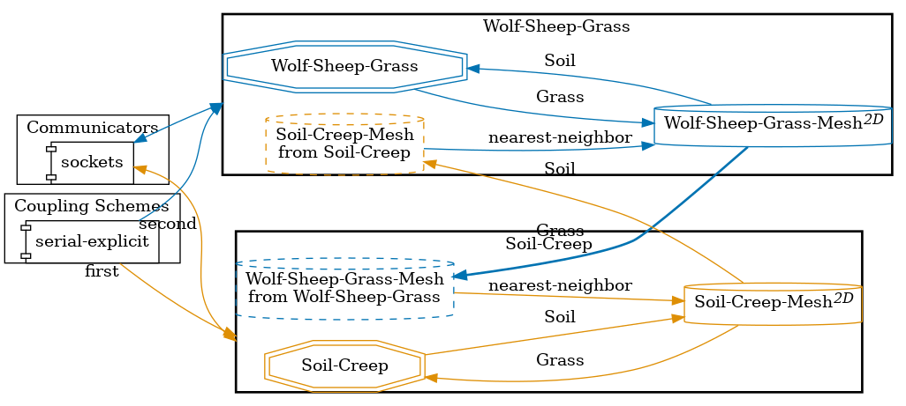
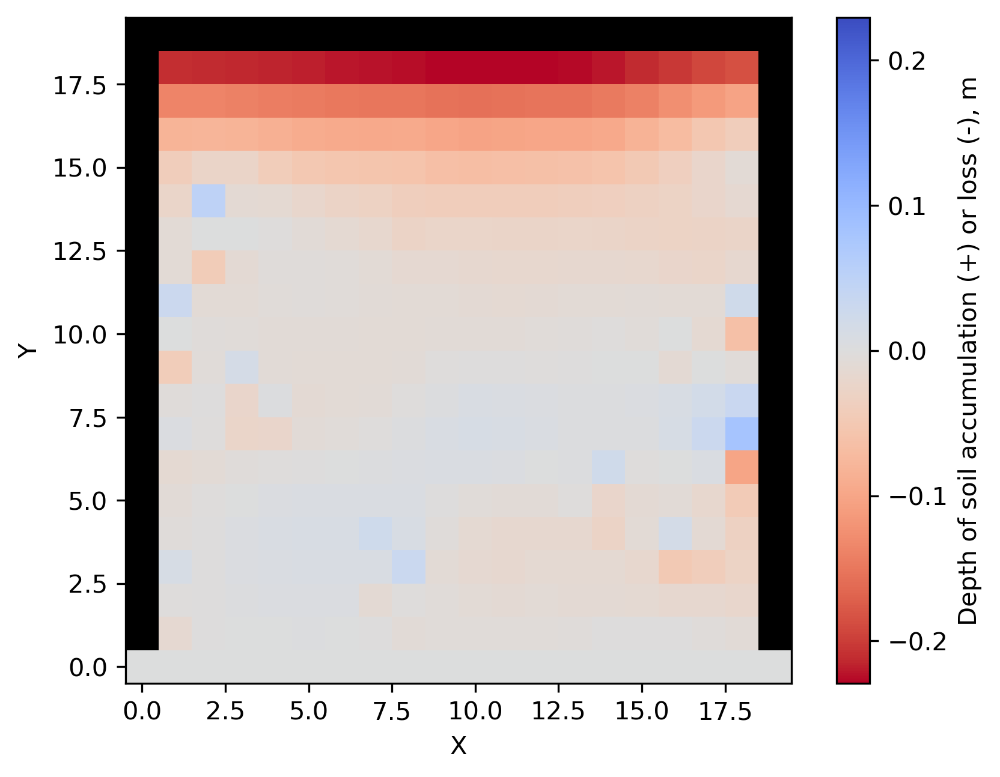
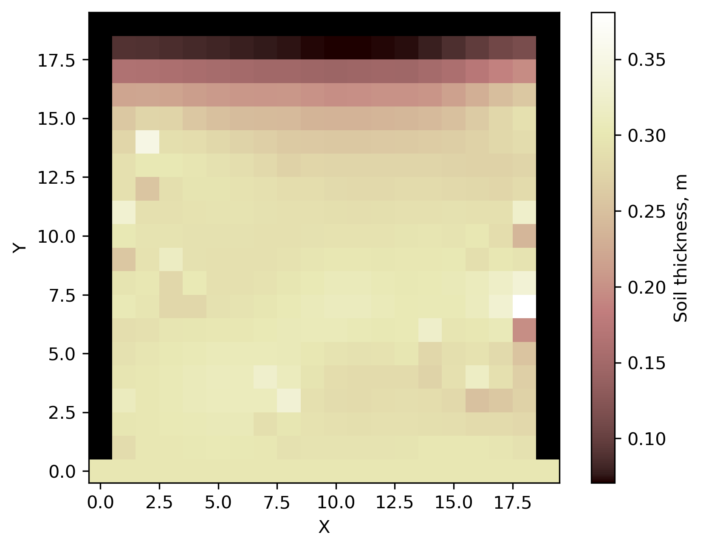
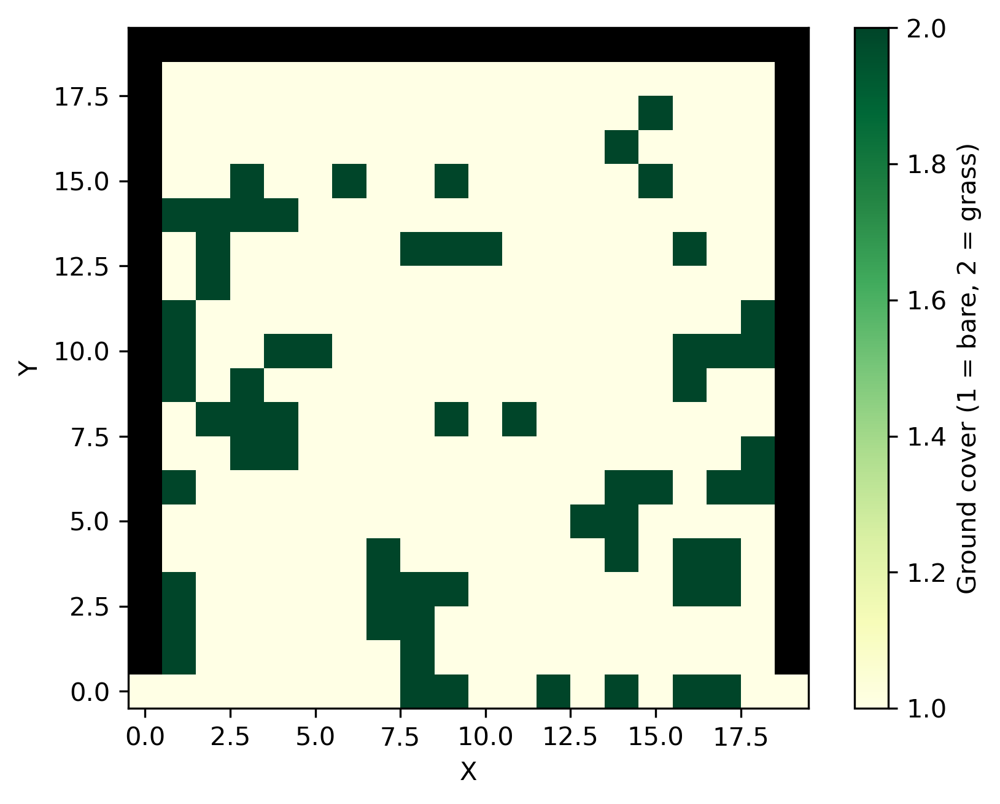


Get the [case files of this tutorial](https://github.com/precice/tutorials/tree/develop/partitioned-pipe-two-phase), as continuously rendered here, or see the [latest released version](https://github.com/precice/tutorials/tree/master/partitioned-pipe-two-phase) (if there is already one). Read how in the [tutorials introduction](https://precice.org/tutorials.html).


## Setup

This is an implementation of Landlab's [Wolf-Sheep-Grass Model with Soil Creep](https://landlab.csdms.io/tutorials/agent_based_modeling/wolf_sheep/wolf_sheep_with_soil_creep.html) example, coupled via preCICE. We couple the [Wolf-Sheep model from MESA](https://mesa.readthedocs.io/latest/examples/advanced/wolf_sheep.html) with a soil creep model implemented in Landlab.

## Configuration

preCICE configuration (image generated using the [precice-config-visualizer](https://precice.org/tooling-config-visualization.html)):



## Available solvers

Soil-Creep PDE participant:

* Landlab. Numerical modeling of Earth surface dynamics. For more information, have a look at the [Landlab documentation](https://landlab.csdms.io/index.html).

Wolf-Sheep-Grass ABM participant:

* MESA. Agent-based modeling (or ABM) framework. For more information have a look at the [MESA documentation](https://mesa.readthedocs.io/latest/index.html)

## Running the simulation

Open two separate terminals and start the soil creep and wolf sheep participant by calling the respective run scripts `run.sh` located in each of the participants' directory. For example:

```bash
cd soil-creep-landlab
./run.sh
```

and

```bash
cd wolf-sheep-grass-mesa
./run.sh
```

## Post-processing

The Soil-Creep participant generates Python-based visualizations. The following examples were generated by setting rng=42 in the WolfSheepScenario for the wolf-sheep-grass participant.




